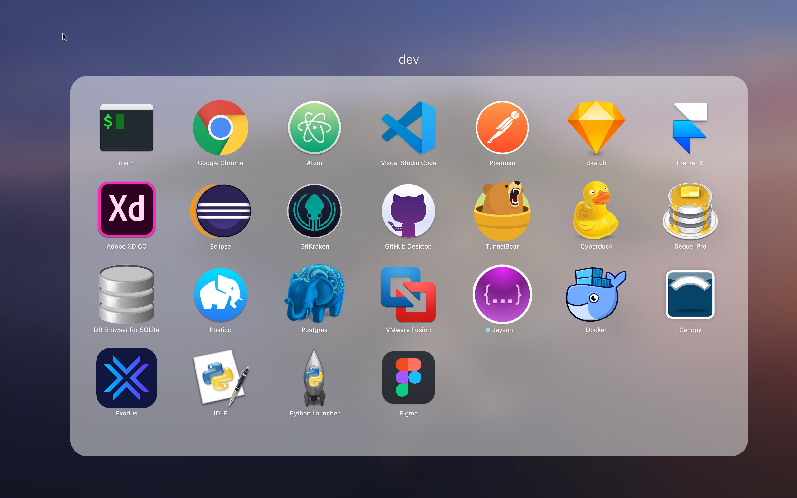
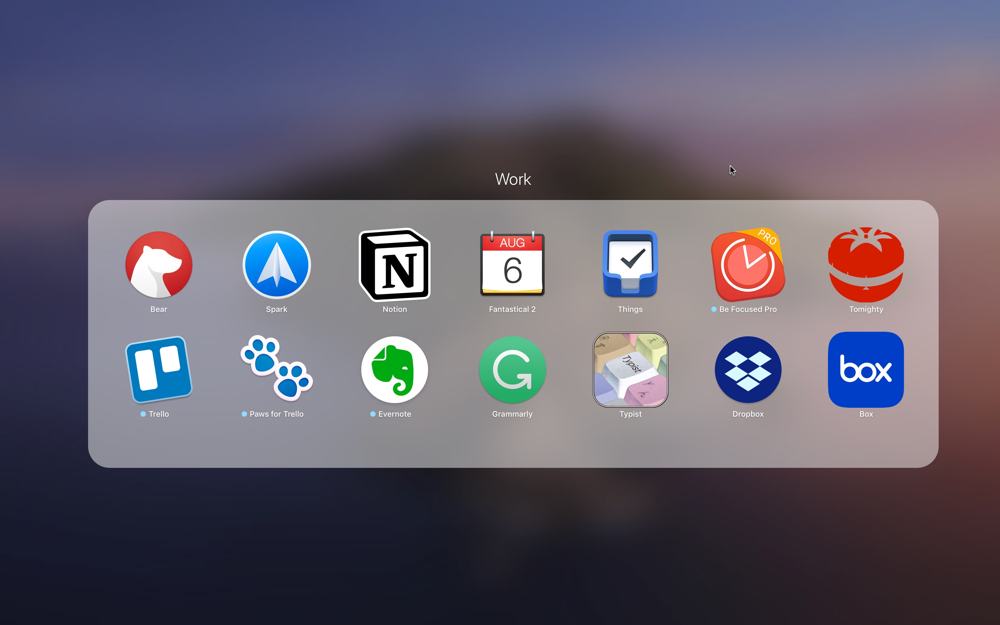
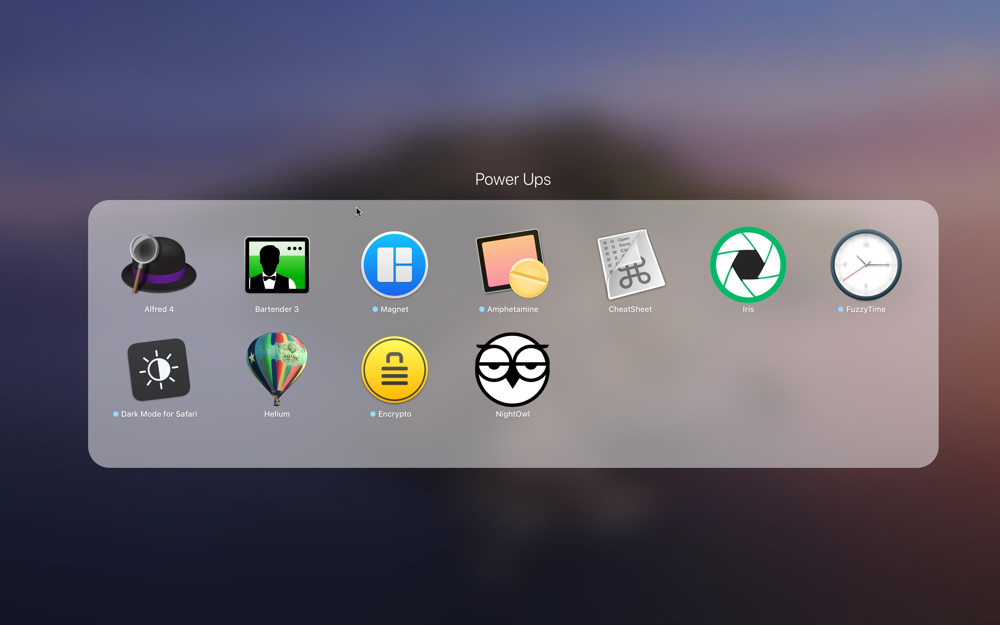
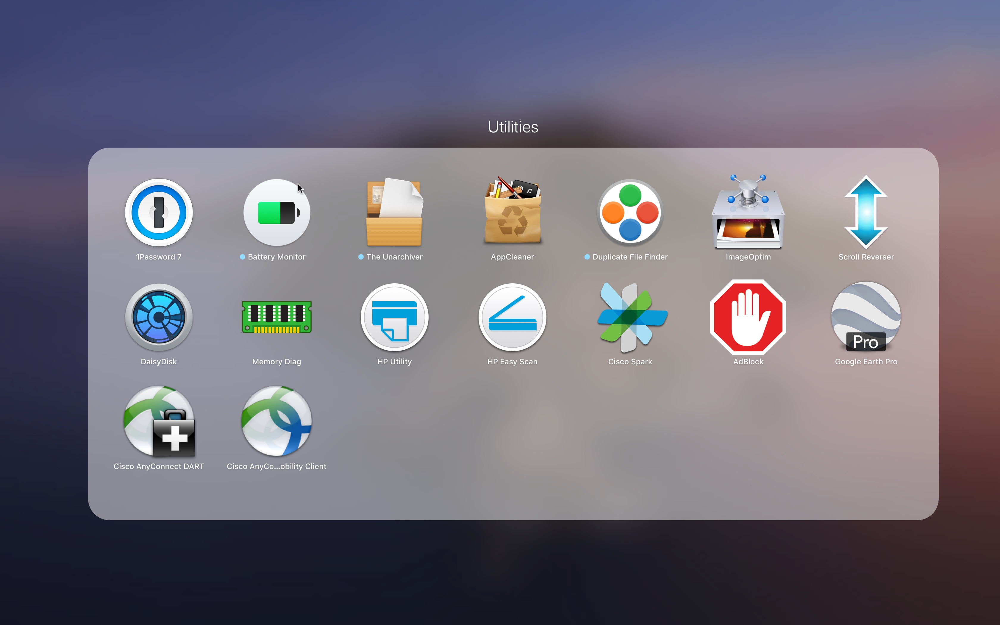

# new-machine-setup

This is how I set up a brand new machine, for software development and general productivity.

## Screenshots






## Essential

- [ ] Alfred 4
- [ ] Atom
- [ ] Bartender 3
- [ ] Google Chrome
- [ ] iTerm
- [ ] Magnet

## Other

- [ ] 1Password 7
- [ ] AppCleaner
- [ ] Bear
- [ ] CheatSheet
- [ ] DaisyDisk
- [ ] Dropbox
- [ ] Fantastical 2
- [ ] Notion
- [ ] Postman
- [ ] Spark
- [ ] Things
- [ ] TunnelBear

## macOS Mojave v. 10.14 Setup

The Setup Assistant will launch once you turn the computer on. Here you'll enter your language, time zone, Apple ID, and so on. I choose not to use "Migration Assistant", and set up my computer from scratch. The first thing you should do is **update macOS** to get the latest security updates and patches.

If you're setting up for the first time, you'll have to install App Store software through the App Store itself, but if you've installed them before, you'll be able to use Homebrew, Cask, and Mas to install all your programs from the command line.

### Homebrew

Install the [Homebrew](http://brew.sh/) package manager. This will allow you to install almost any app from the command line. In previous versions, you'd have to install XCode or Command Line Tools before using this, but that step is no longer necessary.

```bash
/usr/bin/ruby -e "$(curl -fsSL https://raw.githubusercontent.com/Homebrew/install/master/install)"
```

#### Mac App Store

The Mac App Store command line interface, or [mas-cli](https://github.com/mas-cli/mas), will allow you to install from the App Store.

```bash
brew install mas
```

##### Sign in

If you haven't already logged into the App Store, you can do so now.

```bash
mas signin email@email.com
```

#### Brewfile

Now I'll create a file called `Brewfile` in my main directory, which will list all the programs I want on the computer, and install them in a bundle.

Open Terminal, which will be in your home folder by default (`/Users/you`). Create the file.

```bash
touch Brewfile
```

Below are the entire contents of my `Brewfile`, which will install all the above programs with a single command.

```js
tap 'caskroom/cask'
  brew 'git'
  brew 'npm'

  cask '1password'
  cask 'alfred'
  cask 'appcleaner'
  cask 'atom'
  cask 'bartender'
  cask 'cheatsheet'
  cask 'fantastical'
  cask 'google-chrome'
  cask 'notion'
  cask 'postman'
  cask 'tunnelbear'

  mas 'Bear', id: 1091189122
  mas 'FuzzyTime', id: 950297057
  mas 'LastPass', id: 926036361
  mas 'Magnet', id: 441258766
  mas 'Sip', id: 507257563
  mas 'Slack', id: 803453959
  mas 'Spark', id: 1176895641
  mas 'Things', id: 904280696
```

Now simply run this command to install the bundle.

```bash
brew bundle install
```

### Bash

#### Config - `~/.bash_profile`

Now that we have all our programs installed and Homebrew all nice and new, we should create a simple script to keep Homebrew up to date. I found this handy command on this [Best of Homebrew](https://gist.github.com/indiesquidge/ec010eca3ffa254788c2) gist.

First, create a `.bash_profile` dotfile in your home folder.

```bash
touch .bash_profile
```

We'll create a bash alias to combine all the commands to keep Homebrew clean and up to date.

```bash
alias brewup='brew update; brew upgrade; brew cleanup; brew doctor'

```

Run the following command.

```bash
source ~/.bash_profile

```

Now you can run `brewup` to update, upgrade, prune, cleanup, and doctor Homebrew. It's a good idea to do this often, even daily.

```bash
brewup
```

### GitHub

#### Config - `~/.gitconfig`

The first thing you should do with Git is [set your global configuration](https://git-scm.com/book/en/v2/Getting-Started-First-Time-Git-Setup). We can do this by running a lot of small commands which will update the Git configuration file.

```bash
git config --global user.name "First Last"
```

Or we can just create the Git configuration file and input it all ourselves.

```bash
touch .gitconfig
```

Here I'll input my name, email, GitHub username, some aliases to be able to type less and do more, and connect Git to the OS X Keychain so I don't have to type my username and password every time I want to push to GitHub.

```bash
[user]
    name = First Last
    email = email@email.com
[github]
    user = username
[alias]
    a = add
    ca = commit -a
    cam = commit -am
    s = status
    pom = push origin master
    pog = push origin gh-pages
    puom = pull origin master
    puog = pull origin gh-pages
    cob = checkout -b
[credential]
    helper = osxkeychain
```

With the above aliases, I can run `git s` instead of `git status`, for example. The less I have to type repeatedly, the happier I am.

### SSH

If you use SSH (Secure Shell) to connect to any remote hosts via the command line, you can simplify the process.

#### Config - `~/.ssh/config`

Create an SSH config file.

```bash
touch .ssh/config
```

Add the following contents, changing the variables for any hosts that you connect to. Using the below will connect to `-i key.pem example-user@example.com`. You can remove the IdentityFile if you don't connect with a pem key. The output will then simply be `example-user@example.com` and you'll be prompted for password authentication.

```bash
Host example
  HostName example.com
  User example-user
  IdentityFile key.pem

```

Now just run the alias to connect.

```bash
ssh example
```

#### Generate SSH key

You can [generate an SSH key](https://help.github.com/articles/generating-a-new-ssh-key-and-adding-it-to-the-ssh-agent/) to distribute.

```bash
ssh-keygen -t rsa -b 4096 -C "email@email.com"
```

### Node.js

We're going to use [Node Version Manager (nvm)](https://github.com/creationix/nvm/blob/master/README.markdown) to install Node.js.

```bash
curl -o- https://raw.githubusercontent.com/nvm-sh/nvm/v0.34.0/install.sh | bash
```

Install the latest version.

```bash
nvm install node
```

Restart terminal and run the final command.

```bash
nvm use node
```

Confirm that you are using the latest version.

```bash
node -v
```

You can also test with `which node`, which will output your Node path and version number.

```terminal
/Users/yourusername/.nvm/versions/node/v7.8.0/bin/node
```

And for later, here's how to update:

```bash
nvm install node --reinstall-packages-from=node
```

### Node Package Manager

I have npm installed, and npm is mostly used locally for projects. The only thing I use globally at the moment is Gulp.

#### Gulp

Install Gulp globally.

```bash
npm install --global gulp-cli
```

### Ruby

Ruby is required to run [Jekyll](/make-a-static-website-with-jekyll/), a popular static site generator. I'm going to download [Ruby Version Manager (rvm)](https://rvm.io/) to make sure I have the updated version of Ruby without messing with the built-in system Ruby.

#### Download rvm

```bash
\curl -sSL https://get.rvm.io | bash -s stable
```

#### Install Ruby version

You can look for and install the latest version by number, or by running the below command.

```bash
rvm install ruby-head
```

You can run `rvm list` to see the full list of versions available. To use the latest version, find the number and run this command.

```bash
rvm --default use 2.4.0
```

Confirm that you are using the latest version.

```bash
rvm -v
```

You can also test with `which ruby`, which will output your Ruby path and version number.

```terminal
/Users/yourusername/.rvm/rubies/ruby-2.4.0/bin/ruby
```

#### Install bundler

Gem is the Ruby package manager that we're going to use to install bundler...a package manager. This is necessary to use Jekyll and useful for any other Ruby project.

```bash
gem install bundler
```

### Install Composer

A necessity for modern PHP development.

```bash
curl -sS https://getcomposer.org/installer | php
```

Add it to the executable path.

```bash
sudo mv composer.phar /usr/local/bin/composer
```

Test it on the command line.

```bash
composer --version
```

### Virtual Hosts

If you're using MAMP like I am to set up an Apache/MySQL/PHP/Python/Ruby environment, [here is a mini-tutorial](/setting-up-virtual-hosts) on setting up virtual hosts.

### Terminal Colors

I like to set a color scheme for my terminal. You can do this from **Preferences**, or by finding one online and opening the **.terminal** file, which will open a terminal with the new preferences. You can then save it as default. Add this to your **bash_profile** to enable colors in Terminal.

I also added something that will show what Git branch you're on.

```bash
export CLICOLOR=1
export LSCOLORS=ExFxBxDxCxegedabagacad
parse_git_branch() {
  git branch 2> /dev/null | sed -e '/^[^*]/d' -e 's/* \(.*\)/ (\1)/'
}
export PS1="\[\033[36m\]\u\[\033[m\]@\[\033[32m\]\h:\[\033[33;1m\]\w\$(parse_git_branch)\[\033[m\]\$ "
```

### Preferences

I have a few preferences I like to set.

- **Keyboard > Text >** Disable “Correct spelling automatically”
- **Security and Privacy > FileVault >** On (makes sure SSD is securely encrypted)
- **Security and Privacy > Firewall >** On (extra security measure)
- **Security and Privacy > General >** App Store and identified developers
- **File Sharing >** Off
- **Users & Groups > Login Items >** Spectacle, Flux (I like these to open on startup)

A few more commands to change some defaults.

#### Show Library folder

```bash
chflags nohidden ~/Library
```

#### Show hidden files

```bash
defaults write com.apple.finder AppleShowAllFiles YES
```

#### Show path bar

```bash
defaults write com.apple.finder ShowPathbar -bool true
```

#### Show status bar

```bash
defaults write com.apple.finder ShowStatusBar -bool true
```

#### Prevent Two Finger Scroll on Chrome

```bash
defaults write com.google.Chrome AppleEnableSwipeNavigateWithScrolls -bool FALSE
```
